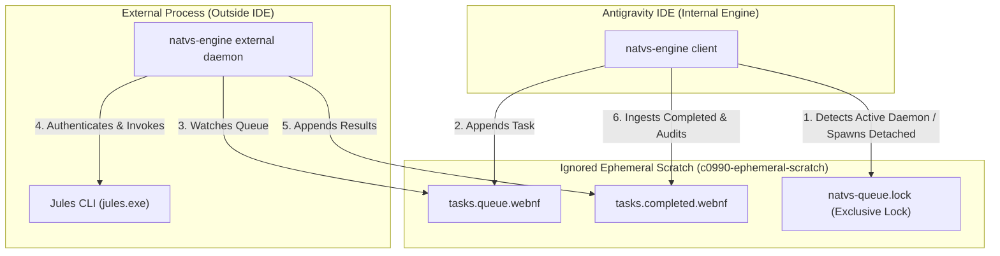

# SACP Coordination Daemon & Task Queue Architecture

The SACP Coordination Engine serves as the workstation-side connection pooler, session manager, and task queue delegator for `natvs-engine`. It coordinates execution between the local IDE (Antigravity v2) and the external, detached companion server daemon executing the Jules agent.

## System Topology

The diagram below outlines the communication pathways when executing a task via the delegated external task queue.

### Key Architectural Concepts

1. **Task Delegation (Path B)**: When `natvs-engine` is launched inside the IDE, it detects if an external companion server is already running by trying to acquire an exclusive lock on `natvs-queue.lock`. If locked, it writes the task to `tasks.queue.webnf` and waits for execution.
2. **Clean-Room Spawning**: If the external daemon is not running, the IDE engine spawns a detached instance of itself. To avoid inheriting the IDE's ambient auth session, the daemon is spawned in a new process group with a minimal whitelisted environment block.
3. **Task Queue Watcher Daemon**: The external daemon runs in a loop, watching `tasks.queue.webnf` for `created` tasks, locking the file via transactions, invoking the Jules CLI, writing completion records to `tasks.completed.webnf`, and updating the queue.
4. **Resilient Transaction-Based Locking**: Lock-file transactions (`BeginQueueTransaction`) are used across all read-modify-write phases on the queue to ensure complete concurrency safety without data loss or race conditions.
5. **No-Index Ephemeral Storage Rationale**:
   - The queue, completion log, and lock files are stored strictly under the `cnnnn-ephemeral-scratch` cognitive layer directory (specifically `c0990-ephemeral-scratch/natvs coordination/`).
   - This prevents Antigravity from indexing these highly volatile, frequently updated files, as `cnnnn-*` directories are ignored by default via `.antigravityignore`. This eliminates excessive IDE indexing and resource overhead.

## Future Abstractions and Improvements

### 1. Multiplexed Background Daemon
Future updates will transition the coordination daemon into a generalized, multi-tenant service multiplexer:
- **SACP Frame Router**: Standardize on a frame-based protocol routing engine allowing multiple concurrent virtual streams (logs, control signals, telemetry) over a single local socket/pipe connection.
- **Ambient Privilege Isolation**: Completely decouple the daemon's runtime credentials from the IDE's active environment, routing credentials through an isolated local keystore to maintain sandboxed execution boundaries.
- **Dynamic Service Registry**: Register backends as driver plug-ins (e.g. `JulesAutonomousFixer`, conformance checker, linter) dynamically matching tasks by domain namespaces.

### 2. Integration with Agent Mesh (`s-a2a`, `s-adk`)
Ultimately, peer-to-peer developer coordination will merge into a unified sovereign agent-mesh:
- Use `s-a2a` (Agent-to-Agent transport) to negotiate workspace tasks.
- Leverage the `s-adk` (Agent Development Kit) runtime interfaces for hermetic sandboxing, telemetry hooks, and metabolic state checking, replacing ad-hoc OS-specific execution daemons with standardized agent-mesh protocols.
