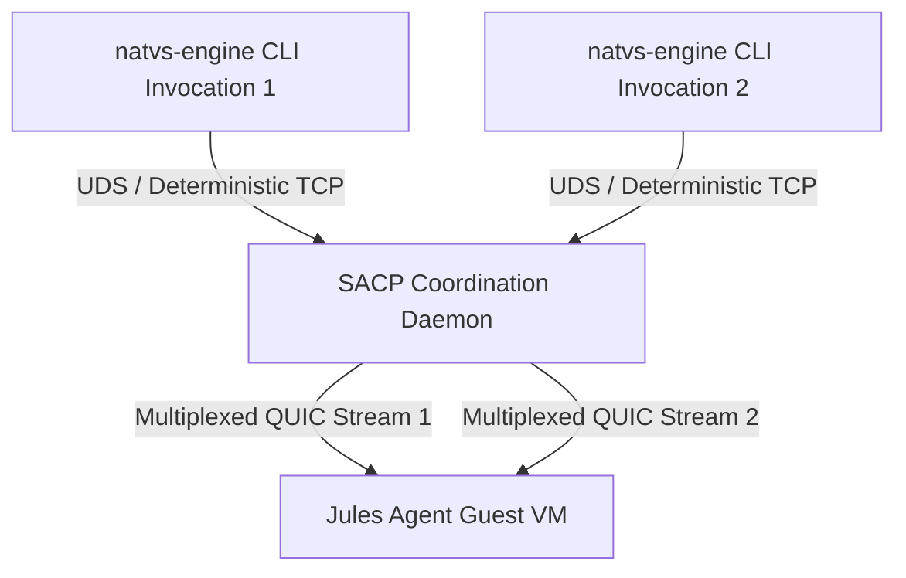

# SACP Coordination Daemon Architecture

The SACP Coordination Daemon serves as the workstation-side connection pooler and session manager for `natvs-engine`. It bridges host CLI command invocations to the isolated Jules agent running inside the Firecracker MicroVM.

## System Topology

### Key Architectural Concepts
1. **Multiplexed Transport**: Leverages `quic-go` to run multiple concurrent command executions over a single active guest session, eliminating Firecracker micro-VM cold boot delays (200ms–300ms) on successive runs.
2. **Platform Portability**: Uses modern Unix Domain Sockets (UDS) for cross-platform compatibility across macOS, Linux, and Windows 10/11.
3. **Lazy Lifecycle Ingestion**: The daemon is only initialized once a session upgrades to QUIC, avoiding unnecessary background resource usage.
