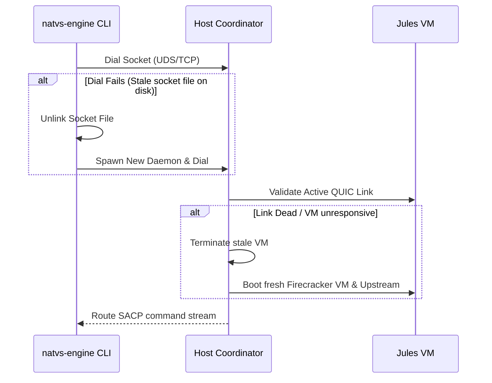

# SACP Coordination Daemon Design Specifications

This document defines the core specifications for port selection, lazy daemon instantiation, and transparent connection fallbacks.

## 1. Lazy Instantiation & Elevation Flow

1. The initial CLI command is initiated and starts SACP negotiation over basic UDP loopback.
2. Once the metabolic hot-swap handshake validates and elevates the session to **QUIC**, `natvs-engine` checks for a running coordination daemon.
3. If no daemon is listening on the designated Unix Domain Socket (UDS) path or deterministic TCP port, the CLI spawns the daemon as an independent background process.

## 2. Deterministic TCP Port Selection

To prevent collisions with other developer-facing services, a deterministic private port in the range `49152` to `65535` (span: `16383`) is calculated by applying FNV-1a hashing on the absolute path of the workspace:

$$\text{Port} = 49152 + (\text{FNV-1a}(\text{AbsoluteWorkspaceRoot}) \pmod{16383})$$

This prevents separate workspaces from interfering with each other's daemon connection pools.

## 3. Resilient Fallback Mechanics

