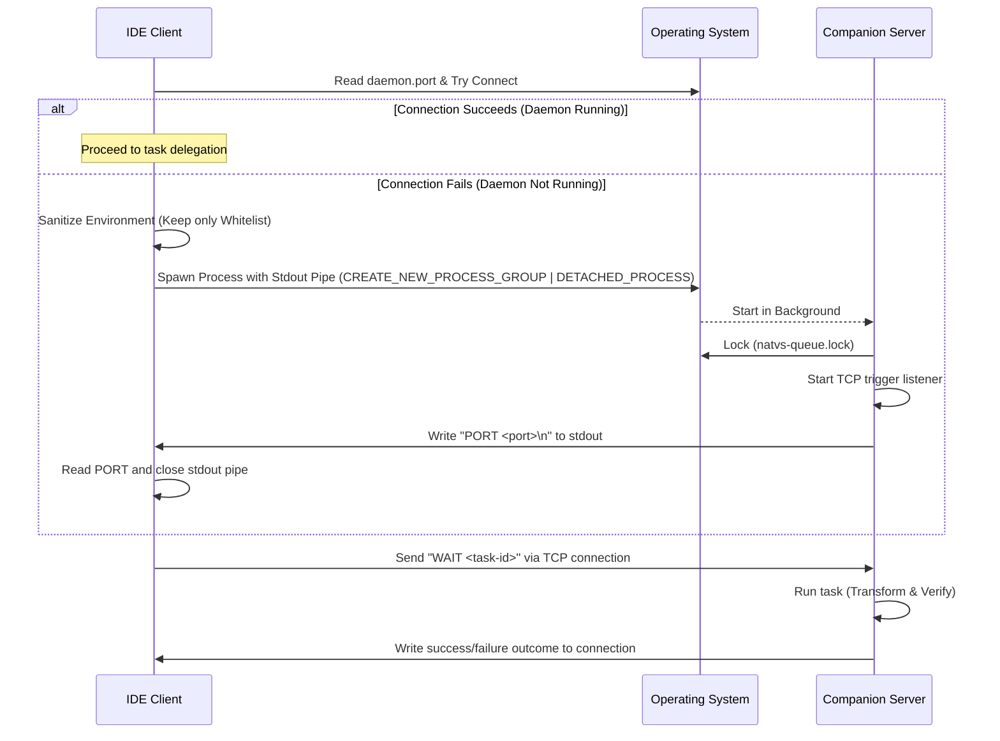
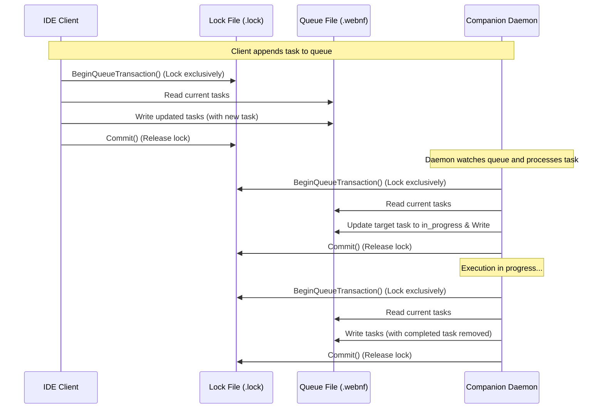

# SACP Coordination Daemon Design Specifications

This document defines the design specifications for process isolation, task serialization formats, and transaction-based locking workflows.

## 1. Process Isolation & Spawn Flow

To prevent the external companion daemon from inheriting the IDE's environment variables and ambient authentication tokens, it is spawned as a detached background process with a minimal whitelisted environment:



## 2. weBNF Task Serialization Schema

All queue registers are governed by formal flat-block weBNF structures separating Task Metadata/State, Task Input payload, and Task Output outcomes.

### Task Input Schema (`tasks.queue.webnf`)
```webnf
Task "<task-id>" {
    timestamp = "<rfc3339>"
    state = "created" | "in_progress"
    objective = "<command-objective>"
    context_path = "<context-path>"
    workspace = "<target-workspace>"
}
```

### Task Output Schema (`tasks.completed.webnf`)
```webnf
TaskResult "<task-id>" {
    timestamp = "<rfc3339>"
    status = "completed_success" | "completed_failure"
    delta_paths = [
        "<file-path-1>",
        "<file-path-2>"
    ]
    error = "<error-message>"
}
```

## 3. Transaction-Based Queue Workflow

To prevent read-modify-write (RMW) race conditions between the IDE Client and the Companion Server during concurrent read/write operations, a transaction locking protocol is enforced:



## 4. Rationale for cnnnn- Directory Storage

Transient coordination files (`tasks.queue.webnf`, `tasks.completed.webnf`, `natvs-queue.lock`) are kept in the cognitive ephemeral workspace directories prefixing with `cnnnn-` (`c0990-ephemeral-scratch/natvs coordination/`).
- **Antigravity Ignoring**: By core system guidelines, `.antigravityignore` contains patterns that ignore `cnnnn-` directories to exclude them from indexing.
- **Resource Preservation**: Indexing frequently changed, lock-contended files inside the IDE leads to severe performance degradation. Grouping them under `cnnnn-` directories completely bypasses the indexing pipeline, ensuring smooth, low-latency IDE operations.

## 5. Jules Isolation Sandbox Layout

To keep active credentials hermetically separated from global toolchain definitions, the environment profile directories are laid out under `s-natives/c1000-credentials` as follows:

```
00flow/s-natives/c1000-credentials/
  ├── whoami.txt                  ← Active Google email address
  ├── tier.txt                    ← Subscription tier status (pro/free)
  ├── user/                       ← Remapped USERPROFILE (contains .jules/ logs)
  ├── appdata/                    ← Remapped APPDATA
  └── localappdata/               ← Remapped LOCALAPPDATA (contains Google/Chrome/User Data/ cookies)
```
